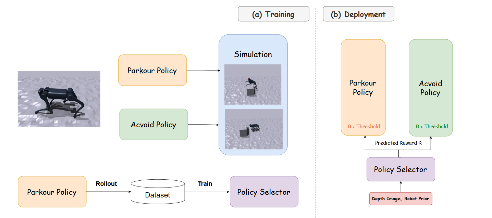
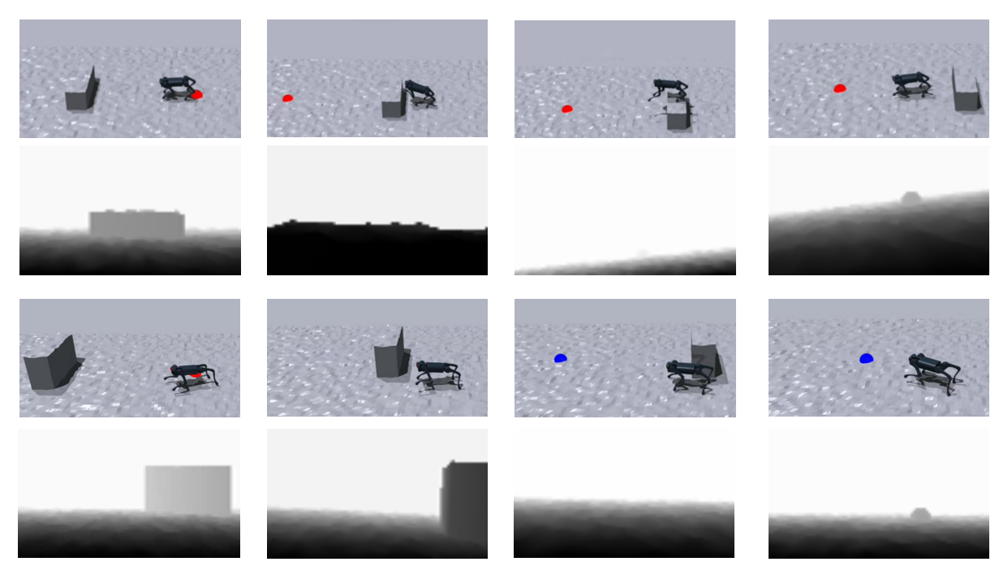

## Pakour but Safe: Agile Navigation with Parkour Skills

> Under Review at ICRMV.

Authors: [Ziyan Li](https://github.com/komorebilzy), [Xinyao Li](https://github.com/lixinyao11)

- [Source Code](https://github.com/lixinyao11/extreme-parkour)

- [Paper In PDF](parkour_but_safe.pdf)

This project uses [extreme-parkour](https://github.com/chengxuxin/extreme-parkour) and [ABS](https://github.com/LeCAR-Lab/ABS).

### Abstract

This paper addresses the challenges of extending parkour skills to practical navigation for legged robots, focusing on obstacle variability, the trade-off between efficiency and safety, and limited environmental perception. We propose a novel approach that integrates parkour policies with safer obstacle-avoidance strategies. Our method uses depth images to inform a policy selector that decides between parkour and avoidance strategies based on obstacle characteristics. By combining simulation-based rollouts with depth-based decision-making, our framework balances agility and safety, enabling more reliable and efficient navigation in complex environments. We validate the approach through simulations, showing that it improves safety and performance compared to baseline methods.

### Architecture

During the training phase, the Parkour Policy and Avoid Policy are trained separately in the simulator. The Parkour Policy is then rolled out to collect data, which is used to train the Policy Selector. During the deployment phase, the Policy Selector computes a reward based on the depth input. If the reward exceeds a predefined threshold, the Parkour Policy is selected; otherwise, the Avoid Policy is chosen.

### Visualization of Our pipline

The first two rows show the robot chooses to parkour through the obstacle when the obstacle is relatively low. The last two rows show the robot chooses to walk around when the obstacle is too high and difficult. The corresponding depth image is shown below the robot.

### Credit

SJTU Course CS348: Computer Vision (2024 Fall) Team E Project.

This page is maintained by CS348 - Group E.